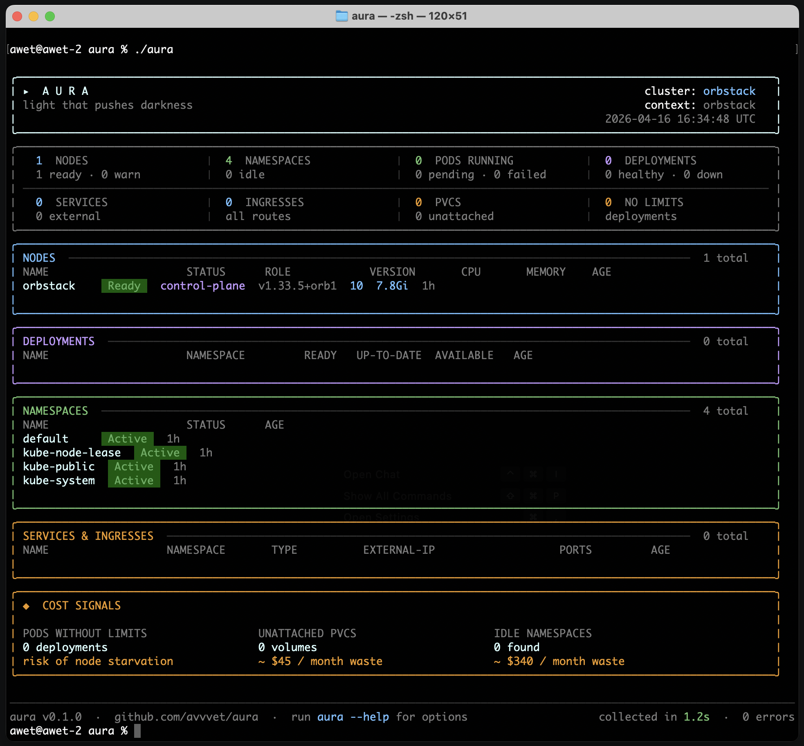

# aura

> the light that pushes darkness.

`aura` is a lightweight Kubernetes cluster intelligence tool for engineers who need the complete picture fast. No agents, no SaaS, no cloud dependency. Just run `aura` and everything becomes clear.

---



---

## what is aura?

You just joined a team, landed a contract, inherited an unknown cluster, or need to troubleshoot fast. One command. Zero setup. aura tells you everything you need to know.

---

## features

- complete cluster snapshot in one command
- nodes, namespaces, pods, deployments, services, ingresses, pvcs
- health status at a glance
- cost signals — idle namespaces, unattached pvcs, missing resource limits
- ai powered analysis via openai, anthropic or local ollama
- zero cluster footprint — no agent, no install, no SaaS
- works on any cluster — eks, gke, aks, kubeadm, k3s, minikube
- air-gapped friendly — data never leaves your machine

---

## install

**binary (linux)**
```bash
curl -L https://github.com/avvvet/aura/releases/latest/download/aura-linux-amd64 -o /usr/local/bin/aura
chmod +x /usr/local/bin/aura
```

**go install**
```bash
go install github.com/avvvet/aura@latest
```

---

## usage

```bash
aura                          # full cluster snapshot
aura --namespace production   # scoped to namespace
aura --context staging        # target different cluster
aura --kubeconfig ~/my.config # explicit kubeconfig
aura --output json            # machine readable output
aura --output yaml            # yaml output
aura --analyze                # ai powered analysis
aura --help                   # all options
```

---

## how it connects

aura follows the standard kubeconfig precedence — exactly like kubectl:

```
1. --kubeconfig flag    explicit override
2. KUBECONFIG env var   ci/cd systems
3. ~/.kube/config       default fallback
```

no configuration needed. if kubectl works, aura works.

---

## ai analysis

aura supports optional ai powered cluster analysis. plug in your preferred llm:

```bash
aura --analyze --llm openai     # uses OPENAI_API_KEY
aura --analyze --llm anthropic  # uses ANTHROPIC_API_KEY
aura --analyze --llm ollama     # local, zero data leaves machine
```

ollama support means full ai analysis in air-gapped environments — no data ever leaves your network.

---

## why aura?

| | aura | kubecost | cast.ai |
|---|---|---|---|
| install | single binary | helm chart | saas agent |
| data privacy | local only | cloud | cloud |
| air-gapped | yes | no | no |
| cost | free | freemium | paid |
| open source | yes | partial | no |
| ai analysis | local llm | no | basic |
| zero footprint | yes | no | no |

---

## author

built by [@avvvet](https://github.com/avvvet) — Senior Golang Engineer & CKA Certified

> your existence alone reveals all.

---

## license

MIT